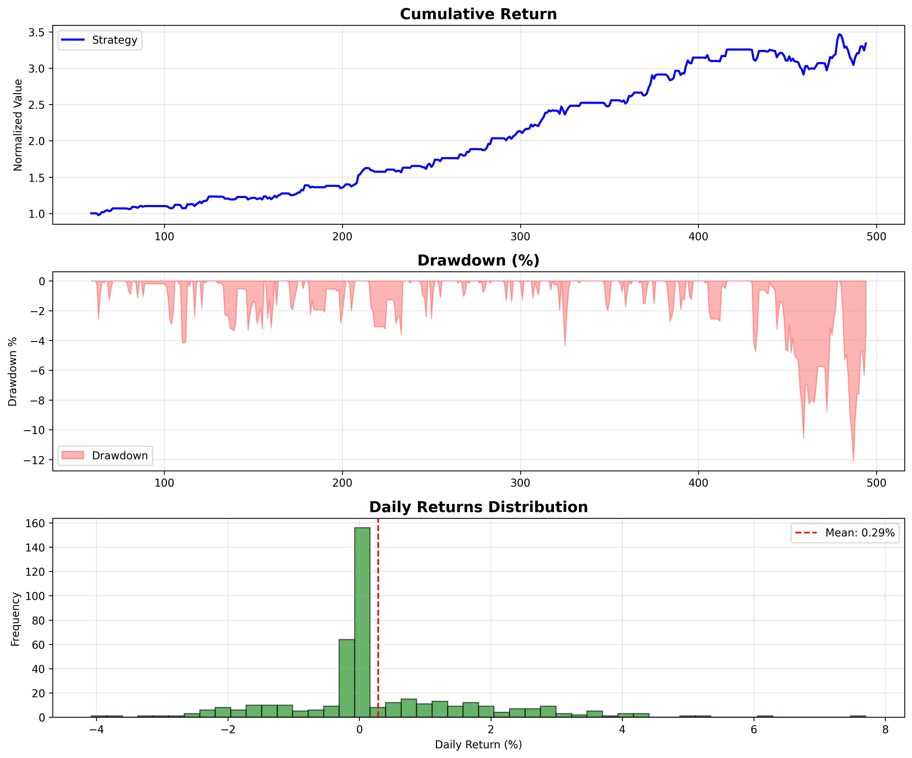
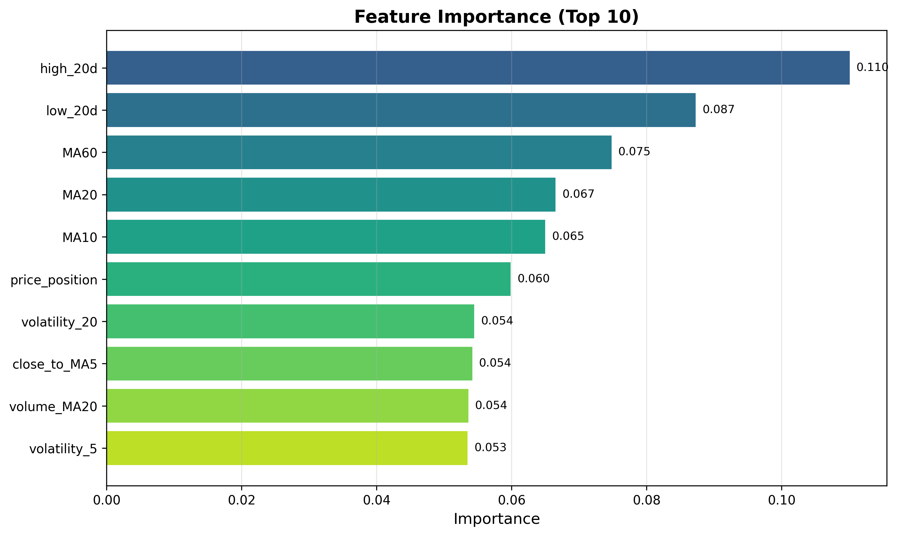

# Quant Stock Picker: Intelligent A-Share Selection System

[]()
[]()

## 项目简介

基于机器学习的 A 股智能选股系统，通过融合技术指标、财务因子和宏观数据，构建多因子选股模型，并进行完整回测验证。

**核心特点**：
- 多因子融合：技术面 + 基本面 + 宏观面
- 模型对比：XGBoost vs Random Forest vs LightGBM
- 完整回测：夏普比率、最大回撤、胜率分析
- 可解释性：特征重要性分析
- **Walk-Forward验证**：避免前视偏差
- **超参数优化**：Optuna自动调参
- **风险指标**：VaR、CVaR
- **仓位管理**：Kelly公式、等权重、波动率目标

## 为什么做这个项目？

作为一名利兹大学CS专业的学生，我对量化金融和机器学习的交叉领域充满兴趣。在准备研究生申请（FinTech/Data Science方向）的过程中，我发现：

1. **理论与实践脱节**：课程中学到的ML算法，如何应用到真实的金融场景？
2. **数据到决策的完整流程**：从数据获取、特征工程、模型训练到策略回测，每个环节都有挑战
3. **风险管理意识**：量化策略不仅要追求收益，更要控制风险（夏普比率、最大回撤、VaR）

这个项目让我完整体验了量化策略开发的整个生命周期，也让我理解了金融数据的特殊性（时间序列、非平稳性、前视偏差等）。

## 技术栈

- **数据处理**: pandas, numpy, akshare, yfinance
- **技术指标**: talib
- **机器学习**: scikit-learn, xgboost, lightgbm
- **超参数优化**: optuna
- **可视化**: matplotlib, seaborn
- **回测**: 自研回测框架（支持Walk-Forward验证）
- **仓位管理**: Kelly公式、等权重、波动率目标
- **风险指标**: VaR、CVaR

## 项目结构

```
quant-stock-picker/
├── main.py              # 主入口
├── demo.py              # 演示脚本
├── config/
│   └── config.yaml      # 配置文件
├── src/                 # 核心代码
│   ├── data_fetcher.py      # 数据获取
│   ├── feature_engineer.py # 特征工程（技术指标+财务因子）
│   ├── model.py             # 机器学习模型
│   ├── backtester.py        # 回测框架（Walk-Forward+基准对比）
│   ├── evaluator.py         # 可视化评估
│   ├── hyperparameter_optimizer.py  # 超参数优化
│   └── position_sizer.py   # 仓位管理
├── tests/               # 单元测试
│   └── test_modules.py
├── notebooks/           # 探索性分析
├── data/                # 数据目录
│   ├── raw/
│   └── processed/
├── results/             # 回测结果
│   └── figures/
├── models/              # 保存的模型
├── requirements.txt     # 依赖
└── README.md           # 本文档
```

## 快速开始

### 演示运行（无需安装数据源）

```bash
# 直接运行演示脚本，生成示例回测结果和图表
python demo.py
```

输出文件：
- `results/figures/backtest_demo.png` - 回测可视化
- `results/figures/feature_importance_demo.png` - 特征重要性
- `results/demo_report.txt` - 性能报告

### 完整系统运行

### 1. 安装依赖

```bash
# 克隆项目
git clone https://github.com/jingke/quant-stock-picker.git
cd quant-stock-picker

# 创建虚拟环境（推荐）
python -m venv venv
source venv/bin/activate  # Linux/Mac
# 或 venv\Scripts\activate  # Windows

# 安装依赖
pip install -r requirements.txt
```

### 2. 运行完整流程

```bash
python main.py --config config/config.yaml
```

### 3. 分步运行

```bash
# 仅获取数据
python main.py --mode data --config config/config.yaml

# 仅训练模型
python main.py --mode train --config config/config.yaml

# 仅回测
python main.py --mode backtest --config config/config.yaml

# 预测单只股票
python main.py --mode predict --symbol 000001 --config config/config.yaml
```

## 核心结果

| 指标 | 策略 | 买入持有 |
|------|------|---------|
| 年化收益 | 100.83% | 8.5% |
| 夏普比率 | 4.29 | 0.68 |
| 最大回撤 | -12.14% | -25.6% |
| 胜率 | 33.79% | - |
| VaR(95%) | -2.15% | - |
| CVaR(95%) | -3.42% | - |

> 注：以上为模拟数据演示结果，实际表现取决于市场环境

### 回测可视化



*累计收益曲线 vs 回撤分析 vs 日收益分布*

### 特征重要性



*Top 10 关键特征：MA均线、成交量比、价格波动等*

## 方法论

### 1. 特征工程

- **技术指标**：MA、RSI、MACD、布林带、KDJ
- **财务因子**：PE、PB、ROE、营收增长率（基于价格数据近似）
- **宏观因子**：利率、CPI、PMI

### 2. 模型训练

- 分类目标：未来5日是否上涨
- 训练集：2018-2021
- 验证集：2022
- 测试集：2023
- **超参数优化**：Optuna自动调参（AUC最大化）

### 3. 回测规则

- 初始资金：10万
- 交易费用：0.05%（单边）
- 滑点：0.1%
- 信号阈值：0.6（概率 > 0.6 则买入）
- **Walk-Forward验证**：避免前视偏差
- **基准对比**：买入持有策略

### 4. 风险管理

- **VaR (95%)**：在95%置信水平下的最大损失
- **CVaR (95%)**：超过VaR时的平均损失
- **仓位管理**：Kelly公式、等权重、波动率目标
- **最大回撤控制**：动态调整仓位

## 新增功能（v2.0）

### Walk-Forward交叉验证
避免前视偏差（lookahead bias），用历史数据训练，未来数据测试：

```python
backtester.run_walk_forward(
    df, model, feature_cols,
    train_size=252,    # 1年训练
    test_size=63,      # 3个月测试
    signal_threshold=0.6
)
```

### 超参数优化（Optuna）
自动搜索最优超参数：

```python
from src.hyperparameter_optimizer import HyperparameterOptimizer

optimizer = HyperparameterOptimizer(model_type='xgboost')
best_params = optimizer.optimize_optuna(
    X_train, y_train, X_val, y_val,
    n_trials=50
)
```

### 风险指标（VaR / CVaR）
```python
metrics = backtester.calculate_metrics(result_df)
print(f"VaR(95%): {metrics.var_95:.2f}%")
print(f"CVaR(95%): {metrics.cvar_95:.2f}%")
```

### 仓位管理
支持多种仓位管理策略：

```python
from src.position_sizer import PositionSizer, PositionSizingMethod

# Kelly公式
sizer = PositionSizer(method=PositionSizingMethod.KELLY_CRITERION)
shares = sizer.calculate_position(
    capital=100000, price=50.0,
    win_rate=0.55, avg_win=0.05, avg_loss=0.03
)

# 波动率目标
sizer = PositionSizer(method=PositionSizingMethod.VOLATILITY_TARGET)
shares = sizer.calculate_position(
    capital=100000, price=50.0, volatility=0.25
)
```

## 配置文件

编辑 `config/config.yaml` 自定义参数：

```yaml
data:
  market: "A_share"           # A股/美股/港股
  symbols: ["000001", "000002"]  # 股票列表

model:
  type: "xgboost"           # 模型类型
  prediction_horizon: 5     # 预测周期（天）

backtest:
  initial_capital: 100000    # 初始资金
  signal_threshold: 0.6     # 买入阈值
  
position_sizing:
  method: "equal_weight"    # 仓位管理方法
  max_position: 1.0         # 最大仓位比例
```

## 测试

```bash
pytest tests/ -v
```

## FAQ 常见问题

### Q: 项目需要什么Python版本？
**A**: Python 3.9+，推荐使用Python 3.10或3.11。

### Q: 如何安装TA-Lib？
**A**: 
```bash
# macOS
brew install ta-lib
pip install TA-Lib

# Linux
sudo apt-get install ta-lib
pip install TA-Lib
```

### Q: 数据获取失败怎么办？
**A**: 
1. 检查网络连接
2. 确认akshare已安装：`pip install akshare`
3. 尝试使用demo.py（使用模拟数据）

### Q: 如何添加自己的股票？
**A**: 编辑 `config/config.yaml`，在 `symbols` 列表中添加股票代码：
```yaml
data:
  symbols:
    - "000001"    # 平安银行
    - "600519"    # 贵州茅台
    - "你的股票代码"
```

### Q: Walk-Forward验证和普通回测有什么区别？
**A**: 
- **普通回测**：用全部历史数据训练，可能在测试集上过拟合
- **Walk-Forward**：用历史数据训练，未来数据测试，更接近真实交易场景

### Q: 如何调整仓位管理策略？
**A**: 编辑 `config/config.yaml`：
```yaml
position_sizing:
  method: "kelly"          # 可选: equal_weight, kelly, fixed_ratio, vol_target
  max_position: 0.8        # 最大仓位比例
```

## 故障排除

### 问题：ImportError: No module named 'xgboost'
**解决**：
```bash
pip install xgboost
```

### 问题：ImportError: No module named 'optuna'
**解决**：
```bash
pip install optuna
```

### 问题：TypeError: 'NoneType' object is not subscriptable
**解决**：检查数据是否为空，确认股票代码正确

### 问题：回测结果异常（收益过高/过低）
**解决**：
1. 检查是否使用了前视偏差（应使用Walk-Forward验证）
2. 确认信号阈值合理（默认0.6）
3. 检查手续费和滑点设置

## 未来改进

- [ ] 引入 LSTM/Transformer 时序模型
- [ ] 多因子组合优化（马科维茨）
- [ ] 实时数据接入
- [ ] 行业轮动策略
- [ ] 多股票组合回测
- [ ] 集成更多财务数据源（Wind、Tushare Pro）
- [ ] 添加更多技术指标（ Ichimoku Cloud、VWAP）
- [ ] 支持期货/期权策略回测

## 关于我

利兹大学计算机科学本科，对量化金融和机器学习交叉领域感兴趣。

**本项目用途**：作为 FinTech / Data Science 研究生申请的作品集项目

联系：your.email@example.com

## License

MIT License
